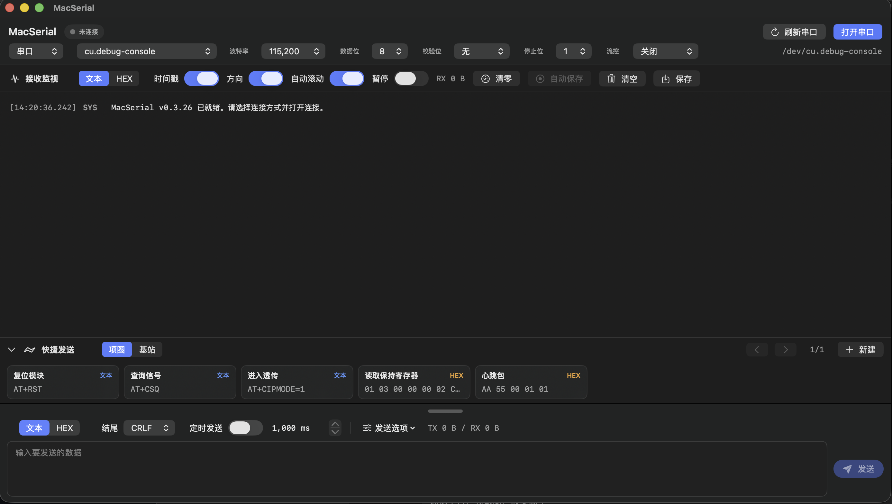
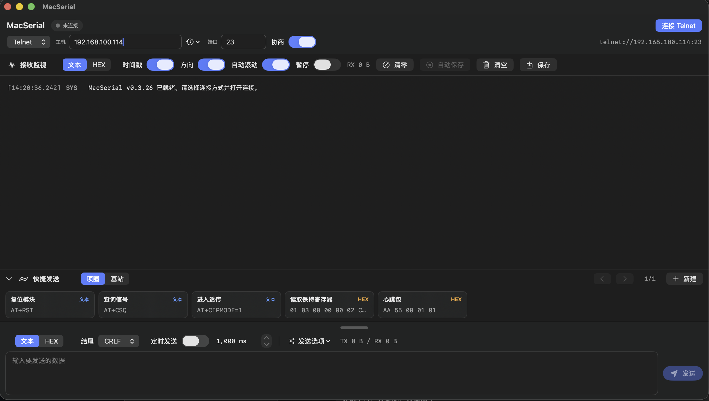

# MacSerial - macOS 串口调试助手 / Telnet 调试工具

MacSerial 是一个原生 macOS 串口调试助手，同时支持 Telnet/TCP 调试。它使用 SwiftUI 构建，适合嵌入式开发、硬件调试、串口收发、串口监视、串口日志记录、AT 指令测试、Modbus 数据收发和网络透传测试。

如果你在找 macOS 上类似 SSCOM、XCOM、串口助手、串口监视器、串口终端、Telnet 调试助手的工具，MacSerial 就是为这个场景做的。

## 搜索关键词

macOS 串口工具、macOS 串口调试助手、Mac 串口助手、串口调试工具、串口调试助手、串口监视器、串口终端、串口收发、串口日志、串口上位机、SSCOM、XCOM、Telnet 调试、Telnet 调试工具、TCP 调试、网络透传、AT 指令调试、Modbus 测试、嵌入式调试、硬件调试、SwiftUI 串口工具。

## 功能

- 原生 macOS SwiftUI 应用
- 串口收发，支持常见串口参数
- 支持 9600、115200、460800、921600 等波特率
- 支持 Telnet/TCP 连接，并过滤基础 Telnet 协商字节
- 支持文本和 HEX 收发
- 支持常用接收编码切换，包括 UTF-8、GB18030、GBK、Big5、Shift-JIS、Latin1 等
- 支持 CR、LF、CRLF 结尾
- 支持 RX/TX 统计、时间戳开关、方向显示开关
- 支持接收监视、自动滚动、暂停、清空和保存
- 支持连接期间自动保存接收内容
- 支持快捷发送、分组、分页和编辑
- 支持发送历史，输入框为空时可用键盘上下键切换历史
- 支持多窗口独立会话，方便同时打开多个串口或 Telnet 连接
- 支持紧凑布局，便于一个桌面同时摆放多个窗口

## 截图

### 串口调试



### Telnet 调试



## 运行环境

- macOS 14 或更新版本
- Swift 6 工具链或 Xcode

## 开发运行

用 Xcode 打开 `Package.swift`，选择 `MacSerial` Scheme，然后按 `Cmd+R`。

也可以使用命令行运行：

```bash
swift run MacSerial
```

## 编译

编译可执行文件：

```bash
swift build
```

生成 macOS `.app` 应用：

```bash
bash Scripts/build_app.sh
```

生成位置：

```text
.build/release/MacSerial.app
```

可以把 `MacSerial.app` 拖到 `/Applications` 使用。

## 开源协议

MacSerial 使用 MIT 协议开源，详见 [LICENSE](LICENSE)。
